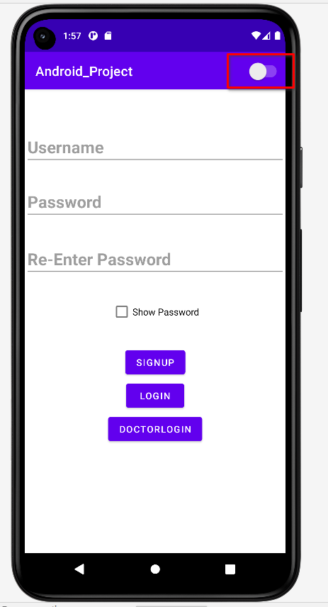
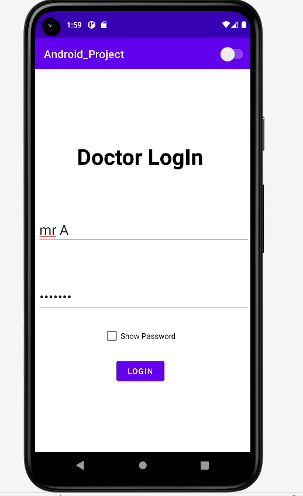
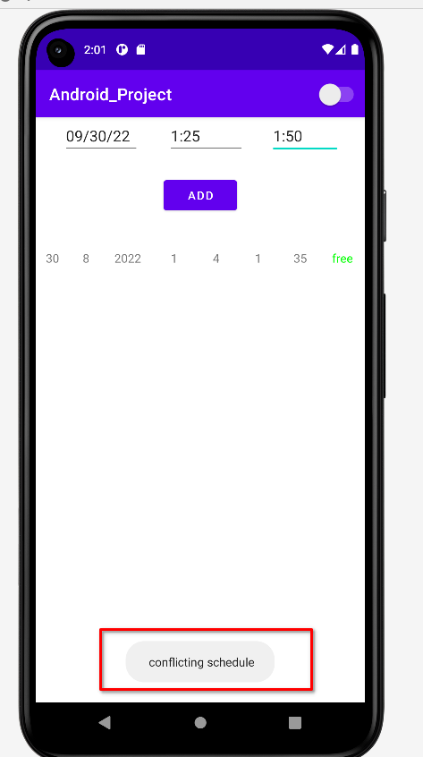
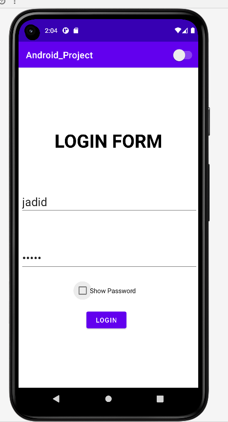
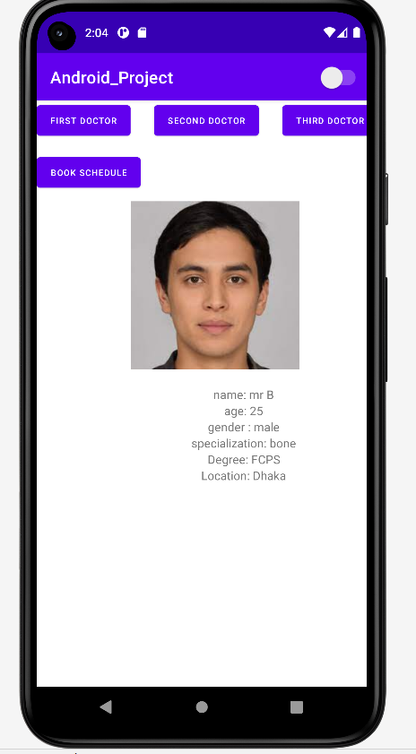
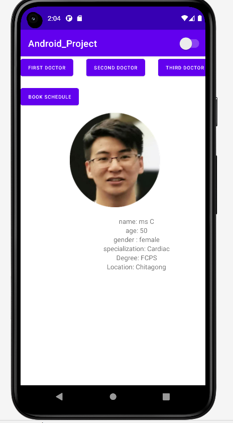
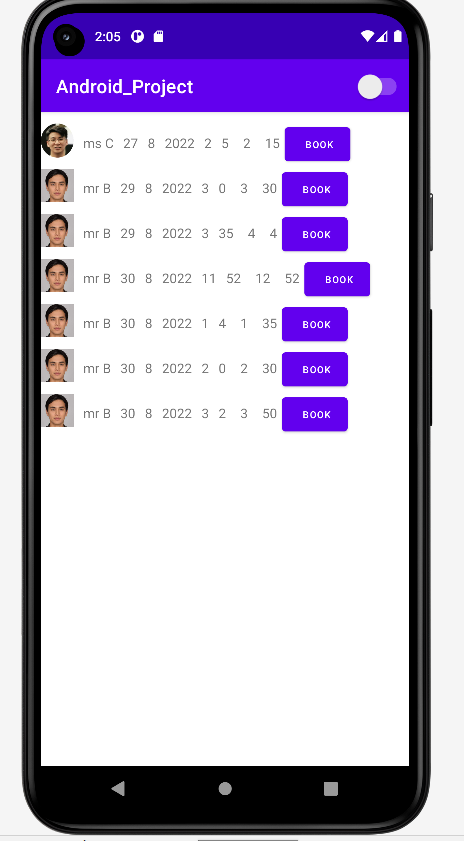
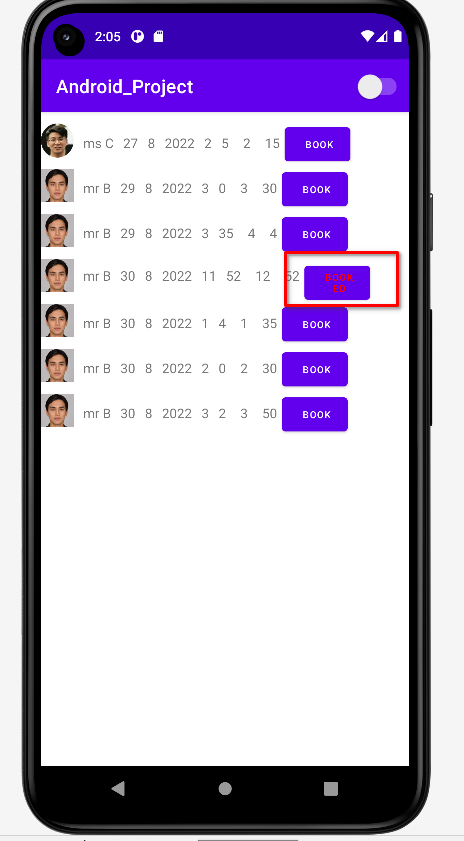
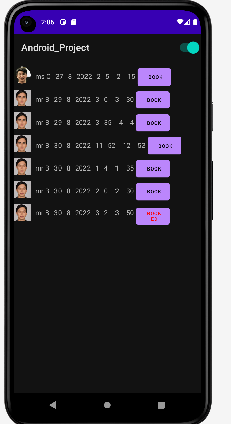
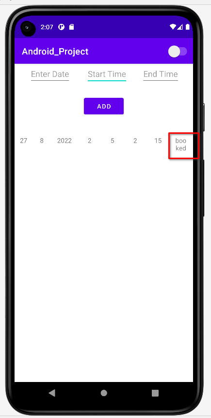

# A native android app where doctors can post schedules and clients can book.
this is the landing page of our app. notice a toggle button in the app bar to switch between night and day mode \
 \
first log in as doctor and add some schedules. else you will not be able to book any schedule as a client \
 \
if any conflicting schedule is entered, system will not accept it \
 \
now log in as a user. you may need to sign up if you don't have an account \ 

 \

you can move around doctor's profile if you wish \
 \
 \

you can book any schedule based on your convenience. Notice only the free schedules will be shown at the first place\
 \

once the schedule is booked, you cannot book it again \ 
 \

here is how the app looks at the dark mode \ 
 \

once a schedule is booked, doctor can see it. however he cannot see who booked\
 \
